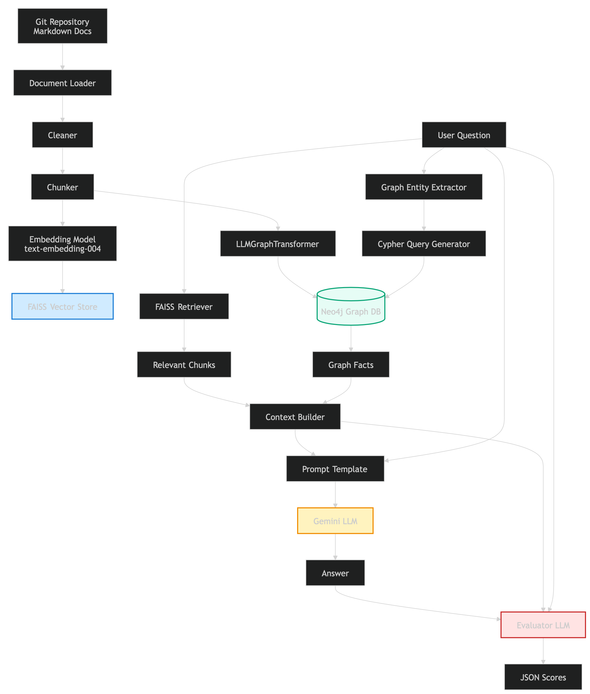

# GenAI Projects im working on...

# 🧠 1. Hybrid RAG for Kubernetes Reasoning
Vector + Knowledge Graph Retrieval using Vertex AI

---

## 🎯 Objective

This project implements a hybrid Retrieval-Augmented Generation (RAG) system over official Kubernetes documentation.

The goal is not only to retrieve relevant documentation, but to enable **causal and relational reasoning** over infrastructure concepts.

The system combines:

- Vertex AI (Gemini)
- FAISS vector search
- Neo4j knowledge graph
- LLM-based structured evaluation

---

# 🏗 System Architecture

The pipeline consists of five main stages:

1. Document ingestion  
2. Vector index construction  
3. Dynamic graph construction  
4. Hybrid retrieval + generation  
5. Evaluation  

Diagram:
<p align="center">
  
</p>
---

# 1️⃣ Document Ingestion

We ingest documentation directly from:

https://github.com/kubernetes/website

To reduce noise, we:

- Restrict ingestion to conceptual documentation
- Remove short or irrelevant files
- Chunk documents for retrieval

Two chunking strategies are used:

| Purpose | Chunk Size |
|----------|------------|
| Vector Retrieval | ~1100 tokens |
| Graph Extraction | Large chunks (~80k) |

This ensures both fine-grained semantic search and structure-preserving graph extraction.

---

# 2️⃣ Vector Index Construction (Semantic Layer)

Each chunk is embedded using:

- `text-embedding-004` (Vertex AI)

Embeddings are:

- Generated in parallel batches
- Indexed using FAISS
- L2-normalized for cosine similarity

Vector retrieval is primarily used for:

- Definitions
- Descriptive questions
- Documentation-grounded answers

---

# 3️⃣ Dynamic Knowledge Graph Construction

Instead of manually defining a schema, we dynamically infer an ontology using Gemini.

## Step A — Ontology Induction

The LLM analyzes documentation samples and proposes:

- Node types (e.g., Deployment, ReplicaSet, Pod)
- Relationship types (e.g., MANAGES, CREATES, RUNS_ON)

If ontology inference fails, a predefined fallback schema is used.

## Step B — Graph Population

Large documentation chunks are transformed into graph entities using:

- `LLMGraphTransformer`

Nodes and relationships are stored in Neo4j.

Post-processing includes:

- Deduplication (case-insensitive merging)
- Orphan node cleanup

This graph layer enables multi-hop traversal and control-plane reasoning.

---

# 4️⃣ Hybrid Retrieval Pipeline

When a query is issued:

## Step 1 — Vector Retrieval

- Retrieve top-k chunks via FAISS
- Rerank via LLM-based relevance scoring
- Filter to high-quality documentation sources
- Build vector context

## Step 2 — Graph Retrieval

- Extract entities from query
- Perform:
  - Single-hop traversal
  - Multi-hop traversal
- Prioritize control relationships:
  - MANAGES
  - CREATES
  - RUNS_ON
  - APPLIES_TO

## Step 3 — Context Assembly

The LLM receives structured and unstructured evidence:

```
GRAPH FACTS:
...
DOCUMENTS:
...
```

---

# Why Hybrid?

Pure vector RAG answers:

> "What is a Deployment?"

Hybrid RAG enables:

> "How does a Deployment update Pods?"

This requires multi-hop reasoning:

Deployment → ReplicaSet → Pod


The graph layer improves:

- Causal explanations
- Control-plane reasoning
- Lifecycle analysis
- Structured comparisons

---

# 5️⃣ Generation

Generation is performed using:

- Gemini (Vertex AI)

Prompt constraints enforce:

- Use only provided context
- Prefer conceptual explanations
- Avoid unsupported claims
- Use graph paths for causal reasoning

This reduces hallucinations and enforces grounding.

---

# 6️⃣ Evaluation Framework

We use an LLM-as-a-judge methodology.

Each question is scored on:

- Retrieval relevance
- Groundedness
- QA accuracy
- Answer quality

To reduce circular validation bias, the evaluator only sees the **vector-retrieved context**, not the graph context.

---

## 📊 Results (Hybrid RAG)

Average scores across benchmark questions:
```
Retrieval Relevance: 4.86
Groundedness: 5.00
QA Accuracy: 4.29
Answer Quality: 4.01
```

### Observations

- Strong definitional accuracy
- Excellent grounding (no hallucinations observed)
- Slight performance drop on structured comparison questions
- High performance on causal multi-hop reasoning

The evaluation does not produce inflated constant scores (e.g., all 5.0), indicating a sufficiently strict judging process.

---

# 🔬 Key Design Decisions

- Separate vector and graph chunking strategies
- Dynamic ontology inference to reduce manual schema engineering
- Multi-hop traversal for controller-level reasoning
- Strict prompting to reduce hallucination
- Reproducible experiment logging

---

# ⚠ Limitations

- LLM-as-judge may introduce bias
- Limited benchmark size
- Graph extraction depends on LLM consistency
- Comparative reasoning can degrade without contrast-aware prompting

---

# 🚀 Future Work

- Add vector-only baseline comparison
- Introduce contrast-aware prompting
- Expand evaluation benchmark
- Add statistical dispersion metrics
- Improve graph extraction stability

---

# Summary

This project demonstrates a production-style hybrid RAG architecture that:

- Integrates semantic and structural retrieval
- Supports multi-hop reasoning
- Minimizes hallucinations
- Provides reproducible evaluation
- Surfaces realistic system limitations

The system is designed as an experiment-driven reasoning framework over complex technical documentation.
